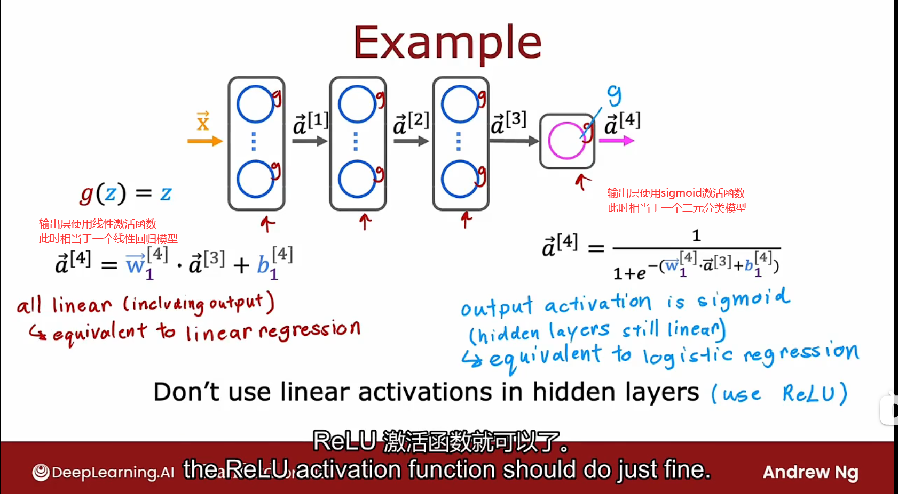
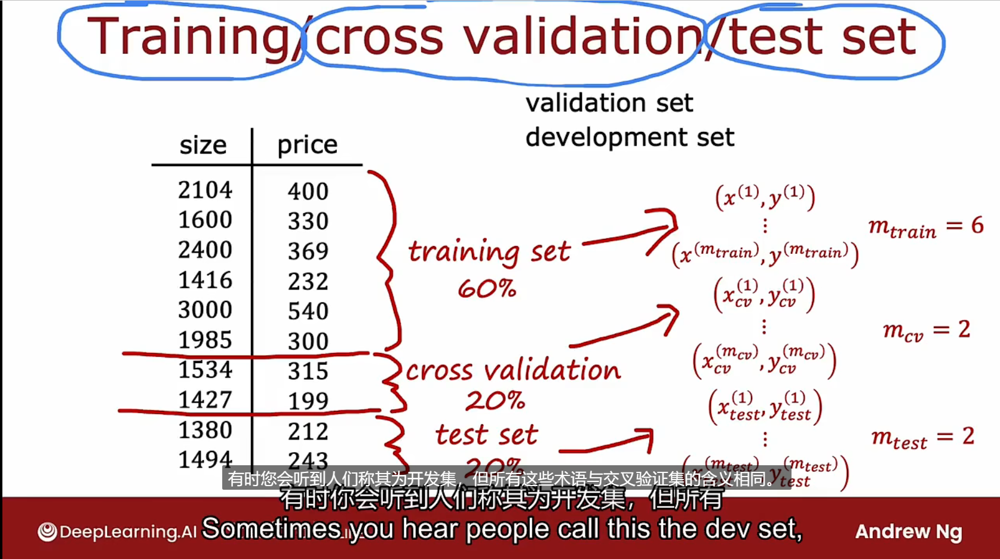
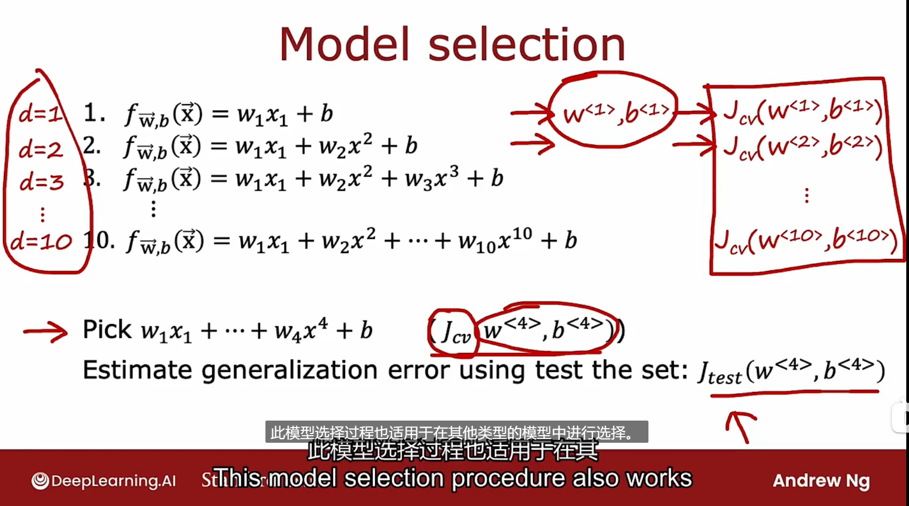
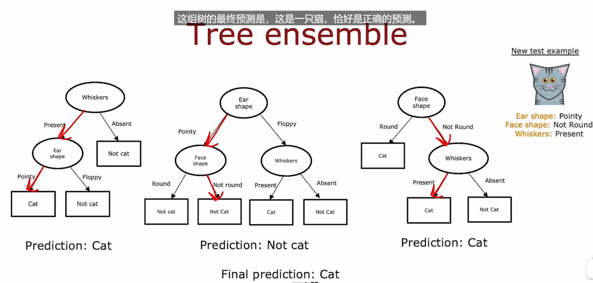
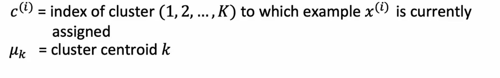
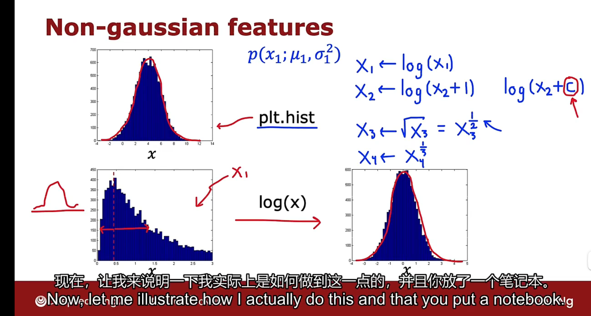
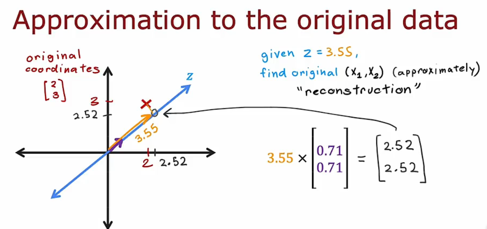
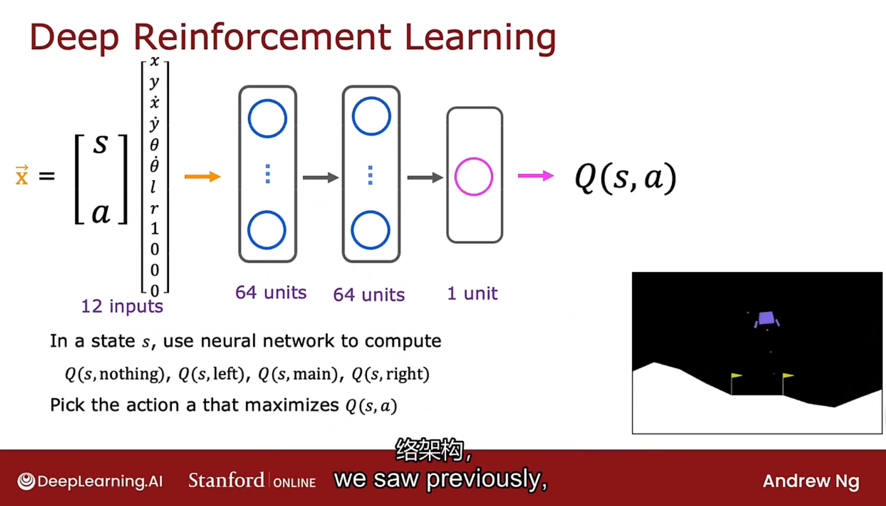

# Machine Learning


## 1. Definition


Field of study that gives computers the ability to learn without being explicitly programmed ---- Arthur Samuel

训练集：用于训练模型的数据集叫做训练集

输入：x/input/feature/input feature

输出: y/output/target

训练示例的总数：m

第i行训练集示例：（x <sup> (i) </sup>,y <sup> (i)</sup>）

特征总数：n

第j个特征：x_j


## 2. supervised learning 

​		监督学习：学习输入、输出或x到y的预测，学习算法从引出的正确答案中学习，预测一个全新的输入（x）的输出（y）


​		监督学习的工作原理可以理解为如下:


### 2.1 回归（Regression）

学习算法试图从无限多的数据中预测一个数据，例如给出房子的面积，预测房价。（从无限多的数据中预测一个数据predict a number）


#### 2.1.1一元线性回归模型(liner regression with one variable)

f<sub>w,b</sub>(x)/f(x)= wx + b(w:weight , b:bias，模型参数)


定义成本函数：衡量一条线与训练数据的拟合程度（J（w,b））


##### 梯度下降（gradient descent）

通过编写梯度下降，自动找到参数w、b的值，从而得到最好的拟合线使成本函数J(w,b)最小化（并不仅仅只适合线性回归函数）

###### 步骤：

1. 对w，b的一些初始值进行猜想，在线性回归模型中，初始值是多少并不重要，所以通常设置为w = 0，b = 0
2. keep changing w，b to reduce  j(w,b)
3. until we settle at or near a minimum(maybe not one result w , b)


$$
\begin{align*} \text{repeat}&\text{ until convergence:} \; \lbrace \newline
\;  w &= w -  \alpha \frac{\partial J(w,b)}{\partial w} \tag{3}  \; \newline 
 b &= b -  \alpha \frac{\partial J(w,b)}{\partial b}  \newline \rbrace
\end{align*}
$$
α：学习率、通常是介于0-1之间的一个数，越靠近1表示下坡的步幅越大（控制下坡的步幅）

α/αw J（w,b）:成本函数的导数项（控制朝哪个方向迈出小步）


重复**同时**更新w和b的值，直到算法收敛（即达到局部最小值）


体验导数（偏导的作用）当只有一个变量w时：（不管初始w选取什么，让w每次的更新都朝着成本函数减少的方向更新）


学习率α的直观作用：


梯度下降当α固定时，前面几次下降速度会快一点（因为导数大），当越接近局部最优解时，下降速度会越来越慢，因为导数基本上=0了


##### 用于线性回归的梯度下降：

注意：

**线性回归的平方误差成本函数（凸函数），成本函数不会也永远不会有多个局部最小值**


成本函数公式结合梯度下降的综合：


代码实现：

1. 计算成本函数

```py
#Function to calculate the cost
def compute_cost(x, y, w, b):
   
    m = x.shape[0] 
    cost = 0
    
    for i in range(m):
        f_wb = w * x[i] + b
        cost = cost + (f_wb - y[i])**2
    total_cost = 1 / (2 * m) * cost

    return total_cost
```

2. 计算偏导


```py
def compute_gradient(x, y, w, b): 
    """
    Computes the gradient for linear regression 
    Args:
      x (ndarray (m,)): Data, m examples 
      y (ndarray (m,)): target values
      w,b (scalar)    : model parameters  
    Returns
      dj_dw (scalar): The gradient of the cost w.r.t. the parameters w
      dj_db (scalar): The gradient of the cost w.r.t. the parameter b     
     """
    
    # Number of training examples
    m = x.shape[0]    
    dj_dw = 0
    dj_db = 0
    
    for i in range(m):  
        f_wb = w * x[i] + b 
        dj_dw_i = (f_wb - y[i]) * x[i] 
        dj_db_i = f_wb - y[i] 
        dj_db += dj_db_i
        dj_dw += dj_dw_i 
    dj_dw = dj_dw / m 
    dj_db = dj_db / m 
        
    return dj_dw, dj_db
```


3. 梯度下降自动计算w，b

```py
def gradient_descent(x, y, w_in, b_in, alpha, num_iters, cost_function, gradient_function): 
    """
    Performs gradient descent to fit w,b. Updates w,b by taking 
    num_iters gradient steps with learning rate alpha
    
    Args:
      x (ndarray (m,))  : Data, m examples 
      y (ndarray (m,))  : target values
      w_in,b_in (scalar): initial values of model parameters  
      alpha (float):     Learning rate
      num_iters (int):   number of iterations to run gradient descent
      cost_function:     function to call to produce cost
      gradient_function: function to call to produce gradient
      
    Returns:
      w (scalar): Updated value of parameter after running gradient descent
      b (scalar): Updated value of parameter after running gradient descent
      J_history (List): History of cost values
      p_history (list): History of parameters [w,b] 
      """
    
    w = copy.deepcopy(w_in) # avoid modifying global w_in
    # An array to store cost J and w's at each iteration primarily for graphing later
    J_history = []
    p_history = []
    b = b_in
    w = w_in
    
    for i in range(num_iters):
        # Calculate the gradient and update the parameters using gradient_function
        dj_dw, dj_db = gradient_function(x, y, w , b)     

        # Update Parameters using equation (3) above
        b = b - alpha * dj_db                            
        w = w - alpha * dj_dw                            

        # Save cost J at each iteration
        if i<100000:      # prevent resource exhaustion 
            J_history.append( cost_function(x, y, w , b))
            p_history.append([w,b])
        # Print cost every at intervals 10 times or as many iterations if < 10
        if i% math.ceil(num_iters/10) == 0:
            print(f"Iteration {i:4}: Cost {J_history[-1]:0.2e} ",
                  f"dj_dw: {dj_dw: 0.3e}, dj_db: {dj_db: 0.3e}  ",
                  f"w: {w: 0.3e}, b:{b: 0.5e}")
 
    return w, b, J_history, p_history #return w and J,w history for graphing
```

4. 调用

```py
# initialize parameters
w_init = 0
b_init = 0
# some gradient descent settings
iterations = 10000
tmp_alpha = 1.0e-2
# run gradient descent
w_final, b_final, J_hist, p_hist = gradient_descent(x_train ,y_train, w_init, b_init, tmp_alpha, 
                                                    iterations, compute_cost, compute_gradient)
print(f"(w,b) found by gradient descent: ({w_final:8.4f},{b_final:8.4f})")
```

5. 随着迭代次数的增加，成本函数的值逐渐下降


6. 预测


#### 2.1.2多元线性回归模型（multiple linear regression）

注意：

1. 是multiple linear regression而不是multivariate regression
2. 是两个向量进行点积


##### 矢量化（vectorization）

优点：

1. 代码简洁
2. 运算速度快


##### 多元线性回归模型梯度下降：


梯度下降：


##### 特征缩放技术

用途：使得梯度下降运行的更快

背景：多个特征，其中有的特征的变化范围可能会相较于其他的特征大得多，这个时候所得到的特征散点图就会显得不规整。由于某个特征的变化范围比较大，因此所对应的w变化一点时，成本函数也会变化很多，这样会使得梯度下降算法无法准确便捷的找到成本函数最小的点（梯度下降运行缓慢），使用**特征缩放技术**可以将某个特征进行缩放（类似于规范化），使得散点图规范许多，同时也可以让梯度下降算法找到一个直接通往最小值的路径


特征缩放方法：

1. 除以最大值


2. 均值归一化（先计算特征的平均值，然后处理特征数据）


3. Z-score标准化（计算标准差西格玛和均值）


何时进行缩放：


##### 如何判断梯度下降是否收敛

1. 制作学习曲线（learning curve）（横坐标是迭代次数，纵坐标是迭代次数所对应的成本函数值）

​      随着迭代次数的增加成本函数变化趋于平缓时，此时就可以认为梯度下降趋于收敛


2. 自动收敛测试（设置一个epsilon，当一次迭代过后成本函数的变化值小于epsilon时，此时可以认为梯度下降趋于收敛）

​		当然epsilon的取值并不好寻找，所以更趋向于使用学习曲线去判断梯度下降是否收敛


##### 如何设置学习率


##### 特征工程（feature engineering）

using intuition to design new features by transforming or combining original features（即为创建一个新特征）


### 2.2 二元分类（binary Classification）

学习算法必须对一个类别进行预测（从相对较少的可能输出中预测类别）

#### logistic regression（逻辑回归）

用于解决输出标签y为0或1的二元分类问题

1. 先使用回归模型对给定的训练集进行训练，得到z = wx + b（此时若直接将训练出来的w和b用于预测，其结果无法固定在0,1两个数）
2. 使用logistic function（相当于复合函数）将z = wx + b带入到g（z）=  1/ 1 + e ^ -z中，这样能够让预测的结果值处于0-1之间（后期可以通过决策边界将值取为0或1）


#### 决策边界（decision boundary）

决策边界是将逻辑回归模型中的预测值y（0-1范围）取一个边界值，当预测值>边界值时，可以认为分类结果为1（0），当预测值 < 边界值时，可以认为分类结果为 0（1）


逻辑转换：1-->2-->3-->4-->5(最后边界计算就到了回归模型里训练出来的w，b-->wx + b何时=0)

1. 


2. 


3. 


4. 


5. 


eg:


#### 成本函数：

1. 平方误差成本函数的不足：（成本变化随着w、b的变化不是一个凸函数，这样会使得梯度下降运行起来出现麻烦）


2. 引入损失函数（L）：

损失函数（L）衡量的是在一个训练样例上的表现如何，随后将所有样例的损失相加获取所有训练样例的损失

而成本函数衡量的是在整个训练集上的表现


分析损失函数(L）：

1. 当y(i) = 1 时，即训练集里的真值为1时，损失函数选用上面的表达式形式，当预测结果

的结果无限接近1时，此时损失函数无限接近于0，当预测结果无限接近于0（即训练集训练出来的w，b对原样本进行预测分析时得到了相反的结果)，此时损失函数无限接近于无穷大。当预测结果预测结果为0.1时，此时表明训练出来的结果有10%的概率认为其结果为1，此时损失函数较大。**x的预测值离y的真值越远，损失也就越大**图例如下：


2. 当y(i) = 0，即训练集里的真值为0时，损失函数选用下面的表达式形式，当预测结果的结果无限接近于0（此时真值也为0)时，此时损失函数无限接近于0，当预测结果无限接近于1（而真值为0)，此时损失函数无穷大，当预测结果的预测值为0.7，此时即有70%的概率认为其预测结果为**1**，此时损失函数也较大。**x的预测值，离y的真值越远，损失也就越大**。图例如下:


从损失函数到成本函数：

成本函数 = 所有样例的损失之和 / m(训练集个数)


损失函数的优化（将两个表达式合并成一个）


成本函数的优化


#### 代码实现

```python
# 计算成本函数
def compute_cost_logistic(X, y, w, b):
    """
    Computes cost

    Args:
      X (ndarray (m,n)): Data, m examples with n features
      y (ndarray (m,)) : target values
      w (ndarray (n,)) : model parameters  
      b (scalar)       : model parameter
      
    Returns:
      cost (scalar): cost
    """

    m = X.shape[0]
    cost = 0.0
    for i in range(m):
        z_i = np.dot(X[i],w) + b
        f_wb_i = sigmoid(z_i)
        cost +=  -y[i]*np.log(f_wb_i) - (1-y[i])*np.log(1-f_wb_i)
             
    cost = cost / m
    return cost


# sigmoid函数
def sigmoid(z):
    """
    Compute the sigmoid of z

    Parameters
    ----------
    z : array_like
        A scalar or numpy array of any size.

    Returns
    -------
     g : array_like
         sigmoid(z)
    """
    # 用于限制数组的值在指定范围内指定数组元素的下限和上限。如果z中的元素小于 -500，则将其替换为 -500；如果元素大于 500，则将其替换为 500。用于避免计算 Sigmoid 函数时出现数值溢出或数值截断的问题。这有助于保持数值计算的稳定性，并提高算法的性能。
    z = np.clip( z, -500, 500 )           # protect against overflow
    g = 1.0/(1.0+np.exp(-z))

    return g


# 偏导计算
def compute_gradient_logistic(X, y, w, b): 
    """
    Computes the gradient for linear regression 
 
    Args:
      X (ndarray (m,n): Data, m examples with n features
      y (ndarray (m,)): target values
      w (ndarray (n,)): model parameters  
      b (scalar)      : model parameter
    Returns
      dj_dw (ndarray (n,)): The gradient of the cost w.r.t. the parameters w. 
      dj_db (scalar)      : The gradient of the cost w.r.t. the parameter b. 
    """
    m,n = X.shape
    dj_dw = np.zeros((n,))                           #(n,)
    dj_db = 0.

    for i in range(m):
        f_wb_i = sigmoid(np.dot(X[i],w) + b)          #(n,)(n,)=scalar
        err_i  = f_wb_i  - y[i]                       #scalar
        for j in range(n):
            dj_dw[j] = dj_dw[j] + err_i * X[i,j]      #scalar
        dj_db = dj_db + err_i
    dj_dw = dj_dw/m                                   #(n,)
    dj_db = dj_db/m                                   #scalar
        
    return dj_db, dj_dw  


# 梯度下降
def gradient_descent(X, y, w_in, b_in, alpha, num_iters): 
    """
    Performs batch gradient descent
    
    Args:
      X (ndarray (m,n)   : Data, m examples with n features
      y (ndarray (m,))   : target values
      w_in (ndarray (n,)): Initial values of model parameters  
      b_in (scalar)      : Initial values of model parameter
      alpha (float)      : Learning rate
      num_iters (scalar) : number of iterations to run gradient descent
      
    Returns:
      w (ndarray (n,))   : Updated values of parameters
      b (scalar)         : Updated value of parameter 
    """
    # An array to store cost J and w's at each iteration primarily for graphing later
    J_history = []
    w = copy.deepcopy(w_in)  #avoid modifying global w within function
    b = b_in
    
    for i in range(num_iters):
        # Calculate the gradient and update the parameters
        dj_db, dj_dw = compute_gradient_logistic(X, y, w, b)   

        # Update Parameters using w, b, alpha and gradient
        w = w - alpha * dj_dw               
        b = b - alpha * dj_db               
      
        # Save cost J at each iteration
        if i<100000:      # prevent resource exhaustion 
            J_history.append( compute_cost_logistic(X, y, w, b) )

        # Print cost every at intervals 10 times or as many iterations if < 10
        if i% math.ceil(num_iters / 10) == 0:
            print(f"Iteration {i:4d}: Cost {J_history[-1]}   ")
        
    return w, b, J_history         #return final w,b and J history for graphing

```


#### 梯度下降

记得同时更新w和b


线性回归模型的梯度下降与二元分类的梯度下降公式的相同于不同之处：


### 2.3过拟合问题（over fitting）

#### 2.3.1什么是过拟合

under fit ---> high bias

over fitting ---> high variance

过拟合即为算法正在非常努力的适应每一个训练样本

回归示例：


分类示例：


#### 2.3.2怎样解决过拟合

1. 获取更多的训练数据
2. 使用更少的特征（eg:不要用太多的多项式特征）


3. 正则化（Regularization）（一种更为温和的方式去减少某些特征的影响，而不用将其彻底消除这么严厉）


##### 正则化：

definition：为了减小某些特征的影响，而不是简简单单的通过删除某些项。

方法：通过修改成本函数的表达式，从而实现正则化。

新成本函数 = 平方误差成本函数 + 正则化项


lambda：正则化系数（参数）

当lambda过小：可能导致over fitting。当lambda过大：可能会导致under fit。


###### 用于线性回归的正则方法

梯度下降：


将偏导带回wj和b中，得到表达式:


表达式背后的意义：正则化在每次迭代所做的事情是将w乘以一个略小于1的数，这样做会稍微缩小wj的值


$$
J(\mathbf{w},b) = \frac{1}{2m} \sum\limits_{i = 0}^{m-1} (f_{\mathbf{w},b}(\mathbf{x}^{(i)}) - y^{(i)})^2  + \frac{\lambda}{2m}  \sum_{j=0}^{n-1} w_j^2 \tag{1}
$$

$$
f_{\mathbf{w},b}(\mathbf{x}^{(i)}) = \mathbf{w} \cdot \mathbf{x}^{(i)} + b  \tag{2}
$$

$$
\begin{align*}
\frac{\partial J(\mathbf{w},b)}{\partial w_j}  &= \frac{1}{m} \sum\limits_{i = 0}^{m-1} (f_{\mathbf{w},b}(\mathbf{x}^{(i)}) - y^{(i)})x_{j}^{(i)}  +  \frac{\lambda}{m} w_j \tag{3} \\
\frac{\partial J(\mathbf{w},b)}{\partial b}  &= \frac{1}{m} \sum\limits_{i = 0}^{m-1} (f_{\mathbf{w},b}(\mathbf{x}^{(i)}) - y^{(i)}) \tag{4} 
\end{align*}
$$


```python
#计算带有正则化的线性回归函数的成本函数代码实现
def compute_cost_linear_reg(X, y, w, b, lambda_ = 1):
    """
    Computes the cost over all examples
    Args:
      X (ndarray (m,n): Data, m examples with n features
      y (ndarray (m,)): target values
      w (ndarray (n,)): model parameters  
      b (scalar)      : model parameter
      lambda_ (scalar): Controls amount of regularization
    Returns:
      total_cost (scalar):  cost 
    """

    m  = X.shape[0]
    n  = len(w)
    cost = 0.
    for i in range(m):
        f_wb_i = np.dot(X[i], w) + b                         #(n,)(n,)=scalar, see np.dot
        cost = cost + (f_wb_i - y[i])**2                               #scalar             
    cost = cost / (2 * m)                                              #scalar  
 
    reg_cost = 0
    for j in range(n):
        reg_cost += (w[j]**2)                                          #scalar
    reg_cost = (lambda_/(2*m)) * reg_cost                              #scalar
    
    total_cost = cost + reg_cost                                       #scalar
    return total_cost                                                  #scalar


# 带有正则化的线性回归梯度下降函数代码实现：
def compute_gradient_linear_reg(X, y, w, b, lambda_): 
    """
    Computes the gradient for linear regression 
    Args:
      X (ndarray (m,n): Data, m examples with n features
      y (ndarray (m,)): target values
      w (ndarray (n,)): model parameters  
      b (scalar)      : model parameter
      lambda_ (scalar): Controls amount of regularization
      
    Returns:
      dj_dw (ndarray (n,)): The gradient of the cost w.r.t. the parameters w. 
      dj_db (scalar):       The gradient of the cost w.r.t. the parameter b. 
    """
    m,n = X.shape           #(number of examples, number of features)
    dj_dw = np.zeros((n,))
    dj_db = 0.

    for i in range(m):                             
        err = (np.dot(X[i], w) + b) - y[i]                 
        for j in range(n):                         
            dj_dw[j] = dj_dw[j] + err * X[i, j]               
        dj_db = dj_db + err                        
    dj_dw = dj_dw / m                                
    dj_db = dj_db / m   
    
    for j in range(n):
        dj_dw[j] = dj_dw[j] + (lambda_/m) * w[j]

    return dj_db, dj_dw

#梯度下降，同之前增加一个lambda参数即可
```


###### 用于逻辑回归的正则方法

成本函数:


梯度下降：


$$
J(\mathbf{w},b) = \frac{1}{m}  \sum_{i=0}^{m-1} \left[ -y^{(i)} \log\left(f_{\mathbf{w},b}\left( \mathbf{x}^{(i)} \right) \right) - \left( 1 - y^{(i)}\right) \log \left( 1 - f_{\mathbf{w},b}\left( \mathbf{x}^{(i)} \right) \right) \right] + \frac{\lambda}{2m}  \sum_{j=0}^{n-1} w_j^2 \tag{3}
$$

$$
f_{\mathbf{w},b}(\mathbf{x}^{(i)}) = sigmoid(\mathbf{w} \cdot \mathbf{x}^{(i)} + b)  \tag{4}
$$

$$
\begin{align*}
\frac{\partial J(\mathbf{w},b)}{\partial w_j}  &= \frac{1}{m} \sum\limits_{i = 0}^{m-1} (f_{\mathbf{w},b}(\mathbf{x}^{(i)}) - y^{(i)})x_{j}^{(i)}  +  \frac{\lambda}{m} w_j \tag{5} \\
\frac{\partial J(\mathbf{w},b)}{\partial b}  &= \frac{1}{m} \sum\limits_{i = 0}^{m-1} (f_{\mathbf{w},b}(\mathbf{x}^{(i)}) - y^{(i)}) \tag{6} 
\end{align*}
$$


```py
#计算带有正则化的分类问题的成本函数代码实现
def compute_cost_logistic_reg(X, y, w, b, lambda_ = 1):
    """
    Computes the cost over all examples
    Args:
    Args:
      X (ndarray (m,n): Data, m examples with n features
      y (ndarray (m,)): target values
      w (ndarray (n,)): model parameters  
      b (scalar)      : model parameter
      lambda_ (scalar): Controls amount of regularization
    Returns:
      total_cost (scalar):  cost 
    """

    m,n  = X.shape
    cost = 0.
    for i in range(m):
        z_i = np.dot(X[i], w) + b                                      #(n,)(n,)=scalar, see np.dot
        f_wb_i = sigmoid(z_i)                                          #scalar
        cost +=  -y[i]*np.log(f_wb_i) - (1-y[i])*np.log(1-f_wb_i)      #scalar
             
    cost = cost/m                                                      #scalar

    reg_cost = 0
    for j in range(n):
        reg_cost += (w[j]**2)                                          #scalar
    reg_cost = (lambda_/(2*m)) * reg_cost                              #scalar
    
    total_cost = cost + reg_cost                                       #scalar
    return total_cost                                                  #scalar
    
# 计算带有正则化的分类问题的偏导实现

def compute_gradient_logistic_reg(X, y, w, b, lambda_): 
    """
    Computes the gradient for linear regression 
 
    Args:
      X (ndarray (m,n): Data, m examples with n features
      y (ndarray (m,)): target values
      w (ndarray (n,)): model parameters  
      b (scalar)      : model parameter
      lambda_ (scalar): Controls amount of regularization
    Returns
      dj_dw (ndarray Shape (n,)): The gradient of the cost w.r.t. the parameters w. 
      dj_db (scalar)            : The gradient of the cost w.r.t. the parameter b. 
    """
    m,n = X.shape
    dj_dw = np.zeros((n,))                            #(n,)
    dj_db = 0.0                                       #scalar

    for i in range(m):
        f_wb_i = sigmoid(np.dot(X[i],w) + b)          #(n,)(n,)=scalar
        err_i  = f_wb_i  - y[i]                       #scalar
        for j in range(n):
            dj_dw[j] = dj_dw[j] + err_i * X[i,j]      #scalar
        dj_db = dj_db + err_i
    dj_dw = dj_dw/m                                   #(n,)
    dj_db = dj_db/m                                   #scalar

    for j in range(n):
        dj_dw[j] = dj_dw[j] + (lambda_/m) * w[j]

    return dj_db, dj_dw  
    
    
# 梯度下降
def gradient_descent(X, y, w_in, b_in, alpha, num_iters，lambda): 
    """
    Performs batch gradient descent
    
    Args:
      X (ndarray (m,n)   : Data, m examples with n features
      y (ndarray (m,))   : target values
      w_in (ndarray (n,)): Initial values of model parameters  
      b_in (scalar)      : Initial values of model parameter
      alpha (float)      : Learning rate
      num_iters (scalar) : number of iterations to run gradient descent
      
    Returns:
      w (ndarray (n,))   : Updated values of parameters
      b (scalar)         : Updated value of parameter 
    """
    # An array to store cost J and w's at each iteration primarily for graphing later
    J_history = []
    w = copy.deepcopy(w_in)  #avoid modifying global w within function
    b = b_in
    
    for i in range(num_iters):
        # Calculate the gradient and update the parameters
        dj_db, dj_dw = compute_gradient_logistic(X, y, w, b，lambda)   

        # Update Parameters using w, b, alpha and gradient
        w = w - alpha * dj_dw               
        b = b - alpha * dj_db               
      
        # Save cost J at each iteration
        if i<100000:      # prevent resource exhaustion 
            J_history.append( compute_cost_logistic(X, y, w, b) )

        # Print cost every at intervals 10 times or as many iterations if < 10
        if i% math.ceil(num_iters / 10) == 0:
            print(f"Iteration {i:4d}: Cost {J_history[-1]}   ")
        
    return w, b, J_history         #return final w,b and J history for graphing

```


## 3. Advanced  Learning algorithms

### 3.1 neural networks（deep learning algorithms）

inference（prediction）：使用别人训练过的神经网络参数来做预测就叫做推理（预测）inference（prediction）

training：有一组标记示例X和Y的训练集，你如何为自己训练神经网络参数

定义：神经网络（Neural Network）是一种计算模型，受到人类神经系统的启发而设计。它是一种用于机器学习和人工智能的算法，可以用于处理各种复杂的任务，例如图像和语音识别、自然语言处理、预测和决策等。

神经网络由大量简单的处理单元（称为神经元）组成，这些神经元相互连接，并在信息处理过程中协同工作。每个神经元都接收来自其他神经元的输入，并产生输出，这些输出又可以成为其他神经元的输入。这种连接方式形成了一个复杂的网络结构。

在训练神经网络时，会提供一组已知的输入和相应的目标输出，称为训练数据。通过多次迭代，神经网络会自动调整其内部参数，以最小化预测输出与目标输出之间的差异，从而学习如何从输入到输出的映射。这个过程称为监督学习，通过这种方式，神经网络可以逐渐改进其预测能力，最终达到对未知数据进行准确预测的能力。

神经网络的深度（即层数）是一个重要的特征，深度较大的神经网络通常被称为深度学习模型。深度学习在过去几年中取得了巨大的成功，并在各种领域取得了重要的突破，例如计算机视觉、自然语言处理、语音识别和推荐系统等。

总结来说，神经网络是一种由互相连接的神经元构成的计算模型，用于机器学习和人工智能任务，特别是在深度学习领域表现出色。


#### 需求预测


多个隐藏层示例：


#### 神经网络中的层（neutral network layer）

how a layer of neuron work?

一些规定：当看到上标[1]的时候，代表与神经网络第一层相关联的数量。 当看到上标[2]的时候，代表与神经网络第二层相关联的数量。 

将第一个隐藏层（layer1）进行放大观察其内部实现细节，第一个隐藏层的三个neuron每个都可以看做接收vector X的输入，得到一个输出（sigmoid 函数），即每一个neuron都可以看做是一个逻辑回归单元，具体细节如下：


将layer2（输出层）进行放大观察其内部细节：


公式：其中l代表第layer l层，j代表第l层的第j个neuron，g代表激活函数，请注意公式中哪些是向量，哪些是标量，不要弄混淆了。


#### 前向传播


用代码实现推理

```py
import numpy as np
from tensorflow.keras.layers import Dense

x = np.array([[200.0, 17.0]])
layer_1 = Dense(units=3, activation='sigmoid')
a1 = layer_1(x)# 即调用layer_1.__call__(x)
print(a1)# tf.Tensor([[0.2, 0.7, 0.3]]), shape=(1, 3), dtype=float64
#Tensor是TensorFlow中一种用来存储matrix的数据类型
a1.numpy()# 将Tensor类型转化为numpy数组类型


chatGPT解释如下：
这段代码使用了 NumPy 和 TensorFlow 库。

首先，import numpy as np 表示导入 NumPy 库并将其简称为 np，这样我们可以使用 np 来调用 NumPy 中的函数和功能。

接着，from tensorflow.keras.layers import Dense 表示从 TensorFlow 库的 Keras 模块中导入 Dense 类。Dense 类是用来创建神经网络中的全连接层（也称为密集层）。

x = np.array([200.0, 17.0]) 创建了一个 NumPy 数组 x，其中包含两个元素，值分别为 200.0 和 17.0。

layer_1 = Dense(units=3, activation='sigmoid') 创建了一个 Dense 层对象 layer_1。这一层有3个神经元（units=3），并使用 Sigmoid 激活函数（activation='sigmoid'）。Sigmoid 激活函数将输入值压缩到范围 [0, 1]，常用于处理二分类问题或作为其他层的激活函数。

a1 = layer_1(x) 将输入数组 x 传递给 layer_1，并得到输出数组 a1。在这里，layer_1 是一个神经网络层，当它接收输入 x 时，它会执行以下操作：

将输入 x 与每个神经元的权重相乘，并加上相应的偏置项。
将加权和传递给 Sigmoid 激活函数，并得到每个神经元的输出。
最后，将这3个神经元的输出作为一个数组返回给 a1。
总而言之，这段代码中创建了一个具有3个神经元的全连接层 layer_1，并将输入数组 x 传递给该层，得到输出数组 a1，其中每个元素都经过了 Sigmoid 激活函数的处理。


layer_1作为一个Dense类的对象为什么可以直接将x作为参数去调用这个对象？

在 TensorFlow 的 Keras API 中，Dense 类被设计为可调用对象，这使得它可以像函数一样使用。这是通过在 Dense 类中实现 __call__ 方法来实现的。

当你创建一个 Dense 层对象时，例如：

layer_1 = Dense(units=3, activation='sigmoid')
实际上，你在创建一个类实例，而 Dense 类在其内部具有 __call__ 方法。这意味着你可以直接像调用函数一样使用 layer_1 对象，并传递输入数据 x 给它。当你调用 layer_1(x) 时，实际上会调用 layer_1.__call__(x) 方法。

在 __call__ 方法内部，会执行与输入数据 x 相关的计算，包括对权重和偏置的操作，以及激活函数的应用。最终，__call__ 方法返回该层的输出。

这种设计使得在神经网络的前向传播过程中，你可以更自然地使用层对象，就像函数调用一样，从而更加直观地构建神经网络模型。

所以，layer_1(x) 实际上是在调用 layer_1 这个 Dense 层对象，并将输入 x 传递给它，得到该层的输出。
```

#### TensorFlow中的数据表示

numpy中的数组表示:


```py
np.array([1, 2, 3])# 一维数组
np.array([[1, 2, 3]])# 二维数组，1*3
np.array([[1],
		  [2],
		  [3]])# 二维数组 3*1
```

**在TensorFlow中惯例是用矩阵（二维数组）来存储数据的，而在之前的线性回归模型或者逻辑回归模型之中则是使用向量（一维数组）存储数据的**


#### 构建一个神经网络

前面所学的构建神经网络模型：


TensorFlow中另一种构建神经网络模型的方法：（无需手动将将其传递到第一层，第一层经过计算获取激活值后传递给第二层）

1. 将第一层，第二层串起来形成一个神经网络得到一个model模型Sequential
2. 调用model.compile（parameter）
3. 调用model.fit（x,y）
4. model.predict(x_new)---->进行推理或预测


代码底层所做的事情：（为每个神经元硬编码，较为不方便）


更为通用的前向传播模型底层实现：

1. 定义dense函数，将前一层的激活以及给定层的神经元参数w和b作为输入。函数的作用是从上一层输入一个激活值，然后输出当前层的激活值。

   参数如下：

   

```py
def dense(a_in, W, b, g):
	units = W.shape[1]# 获取当前层有几个神经元
	a_out = np.zeros(units) # 将返回值初始化为全0的数组，数组长度等于当前层的神经元个数
	for j in range(uinits): #遍历当前层的每个神经元
		w = W[:,j]# 获取W二维数组中的第j列，即为第j个神经元的w参数
		z = np.dot[w,a_in] + b[j] # 点积加偏置值
		a_out[j] = g[z] #sigmoid函数
	return a_out # 返回a_out
```


#### 神经网络为什么如此高效

原因：矢量化


#### TensorFlow的实现

1. 指定模型，告诉TensorFlow如何计算推理    model = Sequential(Dense(xxx),Dense(xxx))
2. 使用特定的损失函数编译模型    model.compile(loss = BinaryCrossentropy())
3. 训练模型   model.fit(X,Y,epochs = xxx)

具体细节如下：


1. model = Se....


2.告诉TensorFlow loss function also define cost function


3.model.fit()


#### 激活函数

linear activation function（此时相当于没有激活函数 g(z) = z） 、sigmoid function和ReLU function


如何选择激活函数：事实证明，输出层的激活函数会有一个非常自然的选择。

1. 输出层的激活函数选择

   1. 当最终输出结果y是0/1这种二元分类问题时，选择sigmoid函数
   2. 当最终输出结果y可正可负时，选择linear activation function 
   3. 当最终输出结果y只能是0或者正数时，选择ReLU函数

2. 隐藏层的激活函数选择

   ​			**建议使用ReLU作为默认的激活函数**


为什么模型需要使用激活函数？

当模型不使用激活函数（相当于激活函数是线性激活函数时）

​		当隐藏层和输出层都使用线性激活函数，此时神经网络模型相当于一个线性回归模型，此时不如直接使用线性回归模	型进行预测与分析。

​		当隐藏层使用线性激活函数，输出层使用sigmoid激活函数，此时神经网络模型相当于一个二元分类模型，此时不如	直接使用分类模型进行预测和分析。


全是线性激活函数，此时相当于是个回归问题：




#### Softmax

Softmax回归算法是逻辑回归的推广


Softmax回归算法的损失函数：----> 成本函数是损失函数的总和/m，在TensorFlow中成本函数被叫做SparseCategoricalCrossentropy


#### 神经网络中的Softmax输出

注意：a1是z1、z2...z10的函数，这是softmax与其他激活函数的不同，其他激活函数只是z的函数。


在TensorFlow中的代码实现：（不推荐版）


softmax的改进实现：

引例1：

在python中直接输出2.0/1000 和（1.0 + 1.0/1000）-(1.0 - 1.0/1000)时，后者会有精度损失，因为在计算机中用于存储浮点数的寄存器有限，当进行浮点数运算的时候会有精度损失的问题。

引例2：

在二元分类中由于a是个浮点数，此时在计算成本函数的时候，传统的方法是不显示的带入a的值进入成本函数之中，此时相当于引例1中的后者例子，而改进的损失函数就是将a的值显示的带入到损失函数之中（此时相当于引例1中的前者)，这样有利于防止精度损失。代码实现如下：


优化后的代码需要注意以下：

1. 其中输出层的激活函数不再是sigmoid函数，而是liner函数（因为自己显示的将a带入了）
2. 需要在编译的时候指定 from_logits = True（即显示的将a = sigmoid(z)给带入到loss function中了）

优化后的softmax实现：输出层激活函数选择liner，只计算z1~z10的值，成本函数在计算时，直接将式子带入，得到更为精确的计算结果


此时神经网络最后一层不再输出a1，a2...a10,（即为预测概率）而是输出z1，z2...z10的中间结果，因此在最后预测的时候还要进行再操作---> f_x = tf.nn.softmax(logits)


二元逻辑回归也是：在预测的时候必须更改代码来获取输出值，并将其映射通过逻辑函数来实际得到概率


```py
preferred_model = Sequential(
    [ 
        Dense(25, activation = 'relu'),
        Dense(15, activation = 'relu'),
        Dense(4, activation = 'linear')   #<-- Note
    ]
)
preferred_model.compile(
    loss=tf.keras.losses.SparseCategoricalCrossentropy(from_logits=True),  #<-- Note
    optimizer=tf.keras.optimizers.Adam(0.001),
)

preferred_model.fit(
    X_train,y_train,
    epochs=10
)
sm_preferred = tf.nn.softmax(p_preferred).numpy()
print(f"two example output vectors:\n {sm_preferred[:2]}")
print("largest value", np.max(sm_preferred), "smallest value", np.min(sm_preferred))

for i in range(5):
	# 找到预测输出结果中概率最大的索引，即所属的类别。
    print( f"{p_preferred[i]}, category: {np.argmax(p_preferred[i])}")
```


#### 高级优化算法（Adam algorithm）

adam:一种比梯度下降法更快的训练神经网络算法，可以自动调整学习率的大小。具体如下：

1. 如果发现学习率α过小----> α变大
2. 如果发现学习率α过大----> α变小
3. adam算法为每一个w和b所设置的学习率α并不是统一的，而是为每一个参数设置了不同的学习率


在TensorFlow中adam算法的实现：


#### 其他额外的网络层类型

在之前所使用的网络层都是密集层类型，其中该层的神经元都从前一层获取所有的激活输入。（Dense layer）

卷积层（Convolutional layer）：每个神经元只看前面一层的部分输入。


卷积神经网络的具体例子：


#### 计算图


计算图的优势：

1. **高效的反向传播**：计算图通过反向传播算法一次性计算所有参数的梯度，避免了重复计算，从而提高了计算效率。这对于大规模神经网络和复杂模型的训练尤为重要。
2. **自动求导**：计算图能够自动计算参数相对于损失函数的梯度，使得优化算法如梯度下降能够快速调整模型参数，使其逐渐适应数据并优化性能。
3. **灵活性**：计算图的结构灵活，可以轻松扩展和修改复杂的神经网络模型。通过添加或调整节点和边，可以构建更复杂的计算图来适应各种任务。
4. **可视化和直观理解**：计算图的图形表示有助于直观理解模型的计算过程。通过观察计算图，我们可以更清楚地了解模型中的计算关系，方便调试和优化模型。


#### 模型评估

将数据划分为训练集和测试集，使用训练集来训练模型，使用测试集去评估模型的性能。

##### 线性回归：


##### 逻辑回归：


逻辑回归中一种更为常见的定义Jtest和Jtrain的方式：

Jtest：Jtest被定义为在测试集当中被分类错误的分数（个数）

Jtrain：Jtrain被定义为在训练集当中被分类错误的分数（个数）


##### 交叉验证集的引入：

```py
chatGPT:
通常将数据划分为训练集和测试集是为了评估模型在未见过的数据上的泛化性能。训练集用于训练模型的参数，而测试集用于评估模型在新样本上的表现。然而，只使用这两个数据集可能存在一些问题，特别是在模型选择和调优时。

引入交叉验证集是为了解决以下问题：

1. 模型选择：在训练阶段，我们通常会尝试不同的模型或算法，并根据它们在测试集上的表现选择最佳模型。如果仅使用测试集来选择模型，可能会出现过拟合测试集的情况，导致模型在未知数据上的表现不佳。通过引入交叉验证集，我们可以对不同的模型进行多轮训练和验证，得到更稳健的模型选择结果。

2. 参数调优：在某些机器学习算法中，模型有一些超参数需要调优，以便获得最佳性能。使用测试集来进行调优也可能导致模型在测试集上过拟合。通过使用交叉验证集，可以在多个训练验证集上进行超参数搜索和调优，从而更好地估计模型在未知数据上的表现。

3. 数据不足：有时，数据集规模较小，单独的测试集可能不足以提供可靠的模型评估。交叉验证允许我们在有限数据上进行更多的模型训练和验证，从而提高评估的可信度。

常见的交叉验证方法包括 k 折交叉验证和留一交叉验证。k 折交叉验证将数据集划分为 k 个子集，每次取其中一个子集作为验证集，其余 k-1 个子集作为训练集，进行 k 轮训练和验证。留一交叉验证是 k 折交叉验证的一种特例，其中 k 等于数据集的样本数，每个样本都作为一次验证集。

通过使用训练集、测试集和交叉验证集，我们可以更好地评估模型的性能、选择最佳模型和超参数，并在有限数据情况下更可靠地估计模型的泛化性能。
```


将数据分为两个部分（测试集和训练集）会导致乐观估计，因此引出了新的方式（将数据分为三个部分：测试集、交叉验证集和训练集），使用交叉验证集来检验或信任不同模型的有效性或准确性。

三个集的作用：

1. 训练集：
作用：用于训练机器学习模型的参数和权重。模型通过观察训练集中的样本来学习数据的模式和规律，从而能够做出预测。训练集在模型的训练过程中起着至关重要的作用，因为它提供了模型学习的基础。

2. 交叉验证集：
作用：用于模型选择和参数调优。交叉验证集在训练阶段中独立于训练集和测试集，它将训练集划分为若干个子集，然后通过多次训练和验证，用于评估不同模型或算法的性能，从而选择最佳模型和超参数。这有助于避免过拟合测试集，并提供更稳健的模型选择结果。

3. 测试集：
作用：用于评估模型的泛化性能。在训练阶段完成后，使用测试集来测试模型在未见过的新数据上的表现。测试集的目的是模拟模型在实际应用中遇到未知数据的情况，从而提供对模型泛化性能的估计。测试集的结果可以帮助我们了解模型在真实场景中的表现，并判断模型是否存在过拟合或欠拟合等问题。需要注意的是，测试集在整个训练过程中应该被严格保留，避免被用于模型选择或调优，以确保对模型泛化性能的真实评估。



修改划分后的Jtrain、Jtest和Jcv：


交叉训练集用于模型选择，选择出Jcv最小的一个模型：




##### bias（偏差） and variance（方差）进行诊断


high bias--->在训练集上表现不好

high variance--->模型泛化能力不好(即为在cv集上表现比在训练集上的表现能力不好的多)

当Jtrain is high and Jcv is high时表示这个模型具有high bias

当Jtrain is low and Jcv is high时表示这个模型具有high variance


##### 正则化（lambda）对bias和variance的影响


选择lambda的方法（和之前选择degree的程度类似）--->总结使用众多Jcv当中的最小值去选择degree（D）和lambda

当D和lambda的选择不恰当时，都会出现high bias或者high variance


##### judge Jcv and Jtrain is high or low

方法：建立一个基准线

例如下面的基准线是10.6%，这样就意味着这个模型具有high variance问题，而不是high bias问题


选取基准线的方法：


eg：查看baseline和training error的误差是否会很大判断是否有high bias 查看training error和 cv error的差别看是否有high variance


##### 学习曲线

随着mtrain的增加，Jcv（dev error将会逐渐变小，因为训练集增加了可以更好的对模型进行训练）、Jtrain（training error会变大，因为随着训练集的增加，对所有的数据就会更难进行拟合，所以training error会变大）、Jcv始终会大于Jtrain，因为模型是在训练集下进行训练的，所以训练出来的w和b会更偏向于Jtrain。


high bias的学习曲线（under fitting）--->模型选的过于简单，导致无论增加多少新数据都不会降低错误率


high variance的学习曲线（over fitting）

模型的错误率可以随着训练集数量的增多而逐渐趋于baseline


 

##### 神经网络中解决high bias and high variance的方式

第一个圈圈解决的是high bias的问题，计算Jtrain与基准线的大小关系，当差别较大时，选择切换到一个更大的神经网络

第二个圈圈解决的是high variance的问题，计算Jcv与Jtrain的大小关系，出现问题时-->more data-->重新训练


当神经网络中的层和每一层当中的unit增加时是否会出现high variance问题？---> 不会（只要你的正则化参数选择的合适），但可能会减慢你拟合的速度


TensorFlow中神经网络中正则化的方法：


#### 机器学习的迭代过程


#### 错误分析

错误分析是提高学习算法性能的重要方式之一（还有偏差和方差分析也是提高学习算法性能的方式之一）

错误分析：手动查看cv里的错误示例，并试图深入了解算法出错的地方（试图对其进行分类通过相同的特征），分类好之后寻找后续的改进方法。


#### 添加更多的数据

如何添加数据？

1. 无脑添加更多的数据
2. 在错误分析的基础上添加那些错误预测更多的方向的数据，以便模型更好的进行训练
3. 数据增强--->图像识别，音频识别（扭曲图像、放大、缩小图像。音频重叠（添加噪音，开车声音等等））以便得到更多的数据。


4. 数据合成--->eg:使用电脑技术合成一些不同样式的字母进行训练

在图像数据中进行平移、旋转、缩放、翻转等变换，或者在文本数据中进行同义词替换、词序交换等操作。此外，还可以利用生成对抗网络（GANs）等生成模型来合成逼真的新数据样本。


#### 迁移学习


迁移学习的步骤：

注意--->迁移学习的预训练的输入类型要一致

迁移学习的两种方式：

1. only train output layer parameters
2. train all parameters


#### 机器学习项目的完整周期

1. 确定项目范围（决定项目是什么以及你想做什么）
2. 收集数据（确定训练机器学习所需要的数据）
3. 训练模型
4. deploy in production


在步骤4部署中可能要考虑的问题：


#### 稀有class的precision和recall

当遇到一个课题，比如某种罕见的疾病时，比如发病率只有0.01%，此时模型不断输出预测结果为0，这时模型的准确率也很高，但此时模型并不是一个好的模型，此时引入两个率precision（准确率）、recall（检出率）。precision为模型中预测出为1（患病）中实际上真正为1的百分比。recall为实际为1的个数中，有多少被检测出为1的百分比。

precision高：说话靠谱（患者被诊断出患有这种疾病，他真正有疾病的概率）

recall高：遗漏率低（患者真的有这种疾病，被诊断出来的概率）

这两个率可以帮助判断学习算法是否做出了良好的预测或者有用的预测。

具体细节如下：


如何权衡precision和recall

​		当阈值提高时（比如只有当预测结果大于0.7时，此时才预测结果为1），此时意味着只有你非常有信心时，才预测结果为1，此时precision会提高。但此时recall的结果会变低，因为真正患病的人数中，因为预测门槛的提高，将预测出更少的患病人数，所以recall的值会下降。

​		当阈值降低时，则恰好相反。


在多组学习算法当中如何根据precision和recall选择哪一组？

使用F1 score的方式（调和平均数，更强调教小值的平均值）


### 3.2 decision trees

eg：


#### 构建一颗决策树的全过程

1. 决定在根节点使用什么特征
2. 只关注决策树左侧部分，以决定将哪些节点放在那里（拆分的特征是什么即为接下来要使用什么特征）
3. 只关注决策树右侧部分--->同2


所谓maximize purity的意思是指，通过选择这个特征后，能够尽最大可能得将类别划分清楚。


在决策树模型中，什么时候结束分裂时有一条规则是when improvements in purity score are below a threshold这怎么理解。请用中文回答

#### 纯度

熵：衡量一组数据不纯程度的指标（H），也就是说当熵越大时，数据越不纯（越混乱）


#### 选择拆分信息增益

信息增益--->熵的减少

在构建决策树时，决定在节点上拆分哪个特征的方式将基于哪个特征选择可以最大程度的减少熵

选择用哪个特征进行划分的依据是：哪个特征可以最大程度的减小熵，之所以要用上一层的熵值-下一层熵值的加权平均，那是因为当熵值的减小量低于一定程度时就要停止划分，防止过拟合。


信息增益（information gain）的一般公式

p1 left：分类到左边的猫的数量占左边总量的比重

w left：分到左边的数量占总数的比重


#### 对前面所学的整合


#### one-hot技术

使用one-hot方式可以将一个具有多个（大于等于3）离散取值的特征，分开成k个具有两个取值的特征，这样又可以使用之前的方式进行构建决策树。

注意one-hot技术不仅适用于决策树模型，当你把其他的只有两个取值的结果改成0/1取值时，此时也可以使用神经网络进行训练。即one-hot技术也适用于神经网络、线性回归、逻辑回归模型。


#### 如何对连续的取值特征进行构建决策树

方法：考虑要拆分的不同值，计算信息增益取信息增益值最大（熵变化最大的），此时选择对应的值进行拆分即可


#### 回归模型的决策树

用于处理回归问题的树

eg：


回归模型的决策树如何进行特征分割？

在决策树当中，选择的是使用熵进行特征分割，而在回归模型的决策树当中则是尝试减少每个数据子集Y的权重方差。


#### 使用多个决策树

为什么要使用多个决策树？

因为仅仅改变一个样本就有可能导致算法在根部产生不同的分裂，从而产生一颗不同的决策树，这样会使得算法不那么健壮。


构建出多颗决策树，然后对预测样本分别进行决策，预测结果多的为最终结果



#### 如何通过替换采样技术构建多颗决策树

在训练集（10个）里面连续抽10次，注意每次抽的时候都要将样本放回，这样相当于构建了一个新的训练集，但数据还是原来的。


#### 随机森林

在进行了替换采样技术生成了多个训练集后，可能会导致生成的多颗决策树长得一样，这样算法的健壮性就不好，因此引出了随机森林：


决策森林：在对每一个节点进行特征分割时，不再是对所有的（n个特征）进行选择信息增益最大的，而是随机从k个（k一般=根号n）中进行选择信息增益最大的。


#### XGBoost

**超链接**：[chatGpt](https://chat.openai.com/share/76961528-48ac-409e-ba37-f6054db74e68)

XGBoost（eXtreme Gradient Boosting）是一种高性能、可扩展的机器学习库，专注于梯度提升树算法的实现。它被广泛应用于各种机器学习任务，如分类、回归和排名等，因为它在预测性能和训练速度方面都表现出色。以下是关于XGBoost库的一些重要特点：

1. **梯度提升树的改进：** XGBoost通过引入一些创新的技术和优化方法，如正则化项、加权最小二乘损失函数、近似分裂点选择等，提高了梯度提升树的性能，使得模型更稳定、准确。

2. **正则化：** XGBoost支持L1和L2正则化，帮助控制模型的复杂性，避免过拟合。

3. **自定义损失函数：** 用户可以定义自己的损失函数，适应不同的任务需求。

4. **缺失值处理：** XGBoost能够自动处理特征中的缺失值，不需要额外的处理步骤。

5. **并行计算：** XGBoost能够利用多核CPU进行并行计算，加快训练速度。

6. **支持分布式计算：** XGBoost支持分布式计算，可以在集群上训练大规模数据集。

7. **特征重要性评估：** XGBoost能够计算各个特征在模型中的重要性，帮助理解模型的工作原理。

8. **早停策略：** XGBoost可以根据验证集上的性能来自动选择最佳的迭代轮数，避免过拟合。

9. **Python、R、Java等支持：** XGBoost提供多种编程语言的接口，方便使用者在不同环境中应用。

10. **丰富的文档和社区支持：** XGBoost有详细的文档和活跃的社区，可以帮助用户学习和解决问题。

总体而言，XGBoost是一个功能强大且广泛应用的机器学习库，适用于各种数据类型和任务。由于其出色的性能，它在数据科学竞赛和实际项目中都备受青睐。


直觉：通过第一次的替换采样训练生成一颗决策树，然后将训练集里面的数据进行预测，在接下来的B-1次迭代之中会有更大的概率选择那些预测结果错误的样本进行训练（刻意训练）

下面是对你提到的XGBoost的策略的进一步解释：

在XGBoost中，训练是通过迭代的方式进行的，每一次迭代会生成一颗决策树，并且会调整样本的权重以便更关注之前迭代中分类错误的样本。这样的策略使得模型能够在每次迭代中关注之前错误分类的样本，从而逐步纠正错误，提高模型的性能。

具体来说，你提到的“替换采样训练生成一颗决策树”的过程可以进一步解释如下：

1. **初始化权重：** 在第一次迭代开始前，每个样本都有相等的权重。

2. **第一次迭代：** 在第一次迭代中，使用初始权重的训练集生成一颗决策树。由于初始权重相等，每个样本都有相同的机会被选为节点划分的依据。

3. **预测和更新权重：** 在第一颗决策树生成后，根据这颗树的预测结果，对训练集中的样本进行预测。错误分类的样本会被赋予更高的权重，以便在下一次迭代中更关注这些样本。

4. **后续迭代：** 在后续的迭代中，XGBoost会根据调整后的样本权重进行训练。这样，在训练新的决策树时，会更有可能选择之前分类错误的样本，从而纠正模型的预测错误。

总之，XGBoost的核心策略是通过迭代、样本权重调整和决策树生成来逐步改进模型，特别关注之前分类错误的样本，以达到更好的预测性能。这种策略使得XGBoost在处理复杂问题时能够有效地提高准确性。


XGboost优势：


代码：

1. 分类问题
2. 回归问题


#### 什么时候使用决策树/神经网络


## 4. unsupervised learning

​		无监督学习：无监督学习是一种机器学习技术，其中模型不使用训练数据集进行监督。相反，模型本身会从给定数据中找到隐藏的模式和见解。它可以比作在学习新事物时发生在人脑中的学习。

​		无监督学习的目标是**找到数据集的底层结构，根据相似性对数据进行分组，并以压缩格式表示该数据集**。


​		无监督学习的工作原理可以理解为如下:


### 聚类（clustering）

​		聚类是一种将对象分组为聚类的方法，使得具有最多相似性的对象保留在一个组中，并且与另一组的对象具有较少或没有相似性。聚类分析发现数据对象之间的共性，并根据这些共性的存在和不存在对它们进行分类。

#### K-means algorithm

K-means algorithm的直觉执行步骤

1. 随机猜测聚类的中心位置（簇质心）--->通常随机选择K个训练集上的数据作为簇中心
2. K-means会重复做两件事（a.将点分配给簇质心   b.移动簇质心）
3. 如何将点分配给簇质心？---> 点离哪个簇质心更近就将点分配给簇质心
4. 如何移动簇质心--->将属于同一个簇质心的集合取平均，平均位置就是移动后的簇质心位置

K-means algorithm detail




当一个簇质心没有被分配到一个训练样本时的处理办法：

1. 删除这个簇质心
2. 重新随机选择簇质心

#### K-means optimization objective（cost function/distortion function）

K-means 的cost function不可能上升


#### 初始化K-means

初始化K-means中可能会出现局部最优解而导致算法陷入僵局中：


如何解决？--->使用多个随机初始化K


### 异常检测（anomaly detection）

​		find unusual data points

​		用于检测异常事件（eg：金融系统的异常交易与异常事件）

执行异常检测的最常见方法是：density estimation(密度估计)


异常检测的应用：


#### 高斯分布（正态分布）


##### 使用高斯分布举例一个特征的异常检测：

计算u和西格玛：


##### 具有多维特征的密度估计


步骤：


eg：


#### 开发和评估异常检测系统

​	当运行异常检测算法时，如果有一些之前已经有的数据（大部分的正常数据和少数异常数据），此时算法将会运行的较好。因为此时可以将这些已经标记的数据分为cv集和test集进行模型评估（选择合适的epsilon等），此时只需要将未被标记的数据进行训练（这些未被标记的数据可以有正常数据也可以有异常数据），将训练好的模型使用cv集和test集进行模型评估（这两个集合里面的数据有一些是被错误标记的也没有问题），通过这两个集合进行训练选择出合适的epsilon值，这样异常检测算法就会有较好的表现。

```py
这句话的意思是，当你运行异常检测算法时，如果你已经拥有一些已经标记的数据，其中包括大部分正常数据和一些异常数据，那么你可以通过以下步骤来获得更好的算法性能：

1. **数据准备：** 将已经标记的数据分为两部分，一部分作为交叉验证（cv）集，一部分作为测试（test）集。cv集和test集包含了已知的正常数据和异常数据。

2. **模型训练和选择：** 使用未被标记的数据进行模型训练，这些数据可能包含正常数据和异常数据。训练好的模型会学习到正常数据的特征。

3. **模型评估和调整：** 使用cv集和test集来评估训练好的模型性能。通过调整模型的参数，特别是调整一个阈值（epsilon值），您可以决定什么样的模型输出被视为异常。通过在cv集和test集上尝试不同的epsilon值，您可以选择出使模型性能最佳的阈值。

4. **性能评估：** 在cv集和test集上进行评估时，即使其中的数据有一些是错误标记的（可能在标记异常和正常数据时出现误差），也不会太大影响最终的模型选择，因为您会在不同的epsilon值下评估模型的性能，从而得出较为稳健的结论。

综上所述，通过将已知的数据划分为cv集和test集来评估模型，以及通过训练未标记数据和调整阈值来选择合适的epsilon值，您可以在异常检测中获得更好的表现。这种方法利用了已有的标记数据，但也需要小心处理错误标记数据可能带来的影响。
```


eg：


#### 异常检测与监督学习

当有少量的y=1（异常数据）数据与大量的y=0（正常数据）数据，什么时候选择使用异常检测什么时候使用监督学习？

异常检测：从未来示例中试图找到一些之前从来没有碰到过的数据

监督学习：从确定未来示例中找到和之前类似的数据


#### 选择使用什么特征

如何选择特征？

确保提供的特征或多或少是高斯分布的。如果特征不是高斯特征--->change it，让他更符合高斯特征。具体如下：

eg：将不太符合高斯分布的特征通过转换变成较符合的高斯分布（如果在训练集中进行了转换，请注意在cv集和test集也要做转换）



尝试寻找一些新的特征以便让在原来的特征里是异常的被误分为正常的训练样本可以在新的特征样本中得到解决


练习：

```py
# UNQ_C1
# GRADED FUNCTION: estimate_gaussian计算均值和方差

def estimate_gaussian(X): 
    """
    Calculates mean and variance of all features 
    in the dataset
    
    Args:
        X (ndarray): (m, n) Data matrix
    
    Returns:
        mu (ndarray): (n,) Mean of all features
        var (ndarray): (n,) Variance of all features
    """

    m, n = X.shape
    
    ### START CODE HERE ### 
    mu = 1/m * np.sum(X,axis = 0)
    var = 1/m * np.sum((X - mu)**2, axis = 0)
    
    ### END CODE HERE ### 
        
    return mu, var
    
    
    
# 计算概率密度
def multivariate_gaussian(X, mu, var):
    """
    Computes the probability 
    density function of the examples X under the multivariate gaussian 
    distribution with parameters mu and var. If var is a matrix, it is
    treated as the covariance matrix. If var is a vector, it is treated
    as the var values of the variances in each dimension (a diagonal
    covariance matrix
    """
    
    k = len(mu)
    
    # 检查协方差矩阵 var 是否是一个向量（1 维数组）。如果是向量，就将其转换为对角方差矩阵，其中对角线上的元素为每个特征的方差。
    if var.ndim == 1:
        var = np.diag(var)
        
    X = X - mu
    # 计算概率密度
    p = (2* np.pi)**(-k/2) * np.linalg.det(var)**(-0.5) * \
        np.exp(-0.5 * np.sum(np.matmul(X, np.linalg.pinv(var)) * X, axis=1))
    
    return p
    
    
    

# UNQ_C2
# GRADED FUNCTION: select_threshold在交叉验证集上通过精确率和召回率去计算最合适的epsilon

def select_threshold(y_val, p_val): 
    """
    Finds the best threshold to use for selecting outliers 
    based on the results from a validation set (p_val) 
    and the ground truth (y_val)
    
    Args:
        y_val (ndarray): Ground truth on validation set（交叉验证集上的真实值）
        p_val (ndarray): Results on validation set（交叉验证集上的概率密度）
        
    Returns:
        epsilon (float): Threshold chosen 
        F1 (float):      F1 score by choosing epsilon as threshold
    """ 

    best_epsilon = 0
    best_F1 = 0
    F1 = 0
    
    step_size = (max(p_val) - min(p_val)) / 1000
    
    for epsilon in np.arange(min(p_val), max(p_val), step_size):
    
        ### START CODE HERE ### 
        # Predictions based on current threshold epsilon
        predictions = (p_val < epsilon)
        
        # True Positive (tp): Actual anomaly correctly classified as anomaly
        tp = np.sum((predictions == 1) & (y_val == 1))
        
        # False Positive (fp): Actual non-anomaly incorrectly classified as anomaly
        fp = np.sum((predictions == 1) & (y_val == 0))
        
        # False Negative (fn): Actual anomaly incorrectly classified as non-anomaly
        fn = np.sum((predictions == 0) & (y_val == 1))
        
        # Calculate precision and recall
        precision = tp / (tp + fp)
        recall = tp / (tp + fn)
        
        # Calculate F1 score
        F1 = (2 * precision * recall) / (precision + recall)
        ### END CODE HERE ### 
        
        if F1 > best_F1:
            best_F1 = F1
            best_epsilon = epsilon
        
    return best_epsilon, best_F1
```


### 降维（dimensionality reduction）

​		compress data using fewer numbers

​		将一个大数据集压缩成一个小得多的数据集，同时尽可能少的丢失数据


## 5. recommender systems 


引例：查看用户未评价的电影，并尝试预测用户将会如何评价电影（这样就可以向用户推荐他们更有可能评价为五星的电影）


为每一部电影引入两个新特征（浪漫片or动作片），下面使用线性回归模型为用户暂时未评分的电影预测评分。


定义成本函数：（与线性回归模型的成本函数类似）


由于mj只是一个常数，因此直接将mj消除后求成本函数的最小值所得到的w与b是一样的。


假如电影没有额外的特征（爱情片or动作片）如何修改算法？

从数据中学习或得出这些特征，假设已经知道了w和b参数的值，这样就可以通过多个用户协同过滤的方式学习到特征的值


计算特征的成本函数：注意正则化项与前面的不同之处


### 协同过滤算法

使用协同过滤算法是对上面的两个成本函数的总结，在第一个成本函数之中我们已知了特征值而不知道参数w和b，因此我们使用来选择w和b的值，在第二个成本函数中我们已知了参数w和b的值而不知道特征x（i)，因此我们使用

来选择x（i）的值，下面我们将使用协同过滤算法同时来估计w、b、x的值，由于这两个成本函数的第一项本质上都是一样的（计算所有用户的评分误差之和）只不过是两种不同的计算方式，在第一个成本函数之中，使用的是对i求和（i表示的是电影即为一行一行的计算再求和）而在第二个成本函数之中，使用的是对j求和（j表示的是用户即为一列一列的计算再求和），因此可以将这两个成本函数进行合并处理，计算成本函数，同时估计w、b、x。

请注意上面的两种方法只是对已经评分的电影的误差估计的两种方式，他们本质上是一样的。


The collaborative filtering cost function is given by
$$
J({\mathbf{x}^{(0)},...,\mathbf{x}^{(n_m-1)},\mathbf{w}^{(0)},b^{(0)},...,\mathbf{w}^{(n_u-1)},b^{(n_u-1)}})= \frac{1}{2}\sum_{(i,j):r(i,j)=1}(\mathbf{w}^{(j)} \cdot \mathbf{x}^{(i)} + b^{(j)} - y^{(i,j)})^2
+\underbrace{
\frac{\lambda}{2}
\sum_{j=0}^{n_u-1}\sum_{k=0}^{n-1}(\mathbf{w}^{(j)}_k)^2

+ \frac{\lambda}{2}\sum_{i=0}^{n_m-1}\sum_{k=0}^{n-1}(\mathbf{x}_k^{(i)})^2
  }_{regularization}
  \tag{1}
$$


The first summation in (1) is "for all i, j where r(i,j) equals 1" and could be written:
$$
= \frac{1}{2}\sum_{j=0}^{n_u-1} \sum_{i=0}^{n_m-1}r(i,j)*(\mathbf{w}^{(j)} \cdot \mathbf{x}^{(i)} + b^{(j)} - y^{(i,j)})^2
+\text{regularization}
$$

使用梯度下降进行w、b、x的估计：（请注意此时有三个要估计的变量w、b、x）


### 二进制标签

此时只关心用户是否喜欢这个电影（预测是否会点赞/收藏）


二进制标签应用举例：


算法实现：（与线性回归模型到逻辑回归模型类似）


二元制标签成本函数：


### 均值归一化（mean normalization）

​		为何需要均值归一化，当出现一个新的用户（还未观看任何一场电影），此时使用算法对模型的参数进行选择时，由于用户还未对任何一场电影进行评分，因此成本函数的第一项就没有意义（因为所有的r（i,j）都等于0），此时函数就会尽可能让第二项也就是参数w的值越小越好，所以对于还未观看电影的人来说，此时w的值就会被算法运行变成0，而b的值也很有可能会为0，这样算法对于还未观看任何电影的用户的评分预测值=wx+b等于0，这样就会出问题。


均值归一化的步骤：

1. 将评级构建成一个矩阵
2. 计算矩阵每一行的平均值
3. 将矩阵的每一个元素都减去平均值得到新的矩阵
4. 运行算法（最后预测的时候记得加上平均值）
5. 对于没有看过任何一场或者看过很少电影的人来说，最后的预测结果将会是这部电影平均分


### TensorFlow的auto diff

在TensorFlow中可以给出成本函数的计算公式后，根据一定的语法自动去运行梯度下降，避免手动的去计算导数（偏导数），示例如下


### 协同过滤算法在TensorFlow中的实现


### 寻找相关特征（寻找类似的电影、书籍）

​		如何实现寻找类似的电影、书籍，此时只需要计算另一些电影、书籍与当前的特征之间的距离，选择距离最小的就是类似的。


### 协同过滤算法的不足

1. 冷启动问题（对新电影的评分不足问题，对新用户对电影很少评分而缺少数据问题）
2. 无法将一些额外信息进行利用


C:\Program Files (x86)\Microsoft Visual Studio\2022\BuildTools

C:\ProgramData\Microsoft\VisualStudio\Packages

C:\Program Files (x86)\Microsoft Visual Studio\Shared

### 基于内容的过滤算法

​		基于内容的过滤算法：需要一些用户的特征和item的特征，通过使用这些特征决定哪些item和用户可能彼此匹配。基于内容的过滤算法不仅拥有之前的用户对于电影的评分数据，还拥有了用户的数据，电影的数据，这样可以通过这些数据进行更好的推荐。

之前的过滤算法与基于内容的过滤算法的对比：


#### 基于内容过滤算法的实现步骤：

1. 构建user feature和movie feature，两个向量的大小可以不一样


2. learn to match（之前的协同过滤算法需要参数b，而基于内容的过滤算法不一定需要b）

在协同过滤算法中的w(j)就是基于内容过滤算法的V_u(j)(基于user feature计算出来的)，X(i)就是V_m(i)(基于movie feature计算出来的)，注意V_u(j)和V_m(i)的大小必须要一致，这样才能相乘相加。


3. 计算v_u和v_m（使用神经网络模型）


4. 成本函数


基于内容的过滤算法如何找类似item？

和协同过滤算法寻找相关书籍（电影类似）只要计算v_m(k)和v_m(i)之间的距离，选择距离最小的几个即可。


TensorFlow中的基于内容过滤算法实现：


#### 如何从大型目录中推荐

1. retrieval


2. ranking


在ranking步骤中，如果电影在服务器中已经进行了预计算，并存储下来了，那么在这个步骤里只需要计算v_u(j)然后将retrieval中的电影与其相乘得到prediction进行预测。


如何权衡推荐数量和运行效率：


```py
这句话的意思是，为了分析和优化权衡，进行离线实验，以确定在召回更多物品时是否会导致更相关的推荐。具体来说，它关注了以下两个关键概念：

1. **召回更多物品**：意味着在推荐系统的召回阶段，尝试增加从大型目录中筛选出的候选物品的数量。

2. **更相关的推荐**：指的是确保向用户呈现的物品中，与用户兴趣高度相关的物品比例更高。这通过评估用户是否与显示给他们的物品互动（即，是否点击或采取其他相关行动）来衡量。

这个句子建议使用离线实验来验证是否增加召回的物品数量会导致更多用户与推荐的物品互动。如果实验结果表明，在显示给用户的更多物品中，与用户兴趣相关的物品比例较高（p(y(i)=1，其中y(i)表示用户是否与第i个物品互动），那么这可能表明增加召回数量是一个有效的策略，可以改善推荐的质量。

总之，这句话强调了使用实验方法来评估不同召回策略对推荐质量的影响，特别是关注用户与推荐物品的交互情况，以确定最佳的权衡策略。


在上下文中，p(y(i) = 1) 表示一个事件的概率，具体来说是指在用户看到某个物品 i 后，用户与该物品互动（例如点击、购买、喜欢等）的概率。

- y(i) 是一个随机变量，表示用户是否与物品 i 互动。
- p(y(i) = 1) 表示用户与物品 i 互动的概率，也可以理解为用户与物品 i 互动的可能性。

这个概率通常用来评估推荐系统的效果，因为更高的 p(y(i) = 1) 意味着用户更有可能与推荐的物品互动，从而反映了推荐的相关性和质量。推荐系统的目标之一是最大化这个概率，以提供更相关和吸引人的推荐。
```

### PCA（主成分分析算法）

什么是PCA：可以让你获取大量特征的数据，并将特征数量减少到两三个特征以便可以进行绘图和可视化。（有助于实现数据可视化）

如何减少？

找到一个或多个新轴，例如z轴，这样当你在新轴上测量数据坐标的时候，依旧可以获得item的非常有用的信息


PCA技术将50多个特征压缩到2个


#### PCA 算法基本思想

1. 将特征的均值归一化为0（当多个特征的取值差的太大时，还要进行特征缩放）
2. choose an axis（尽可能得到最大的方差）

如何将数据进行降维？

找到z轴的单位向量，使用原来的特征与单位向量进行点积运算，最后得到的运算结果就是这个数据在z轴上的投影长度

当选择多个z轴时，事实证明这几个轴最终是互相垂直的


PCA不是linear regression，首先PCA是无监督学习的一种，线性回归模型是对y进行预测，而PCA是将多个特征进行压缩，在压缩的过程之中尽可能的保持方差


#### PCA的重建

给定压缩后的距离可以近似的得到压缩前的数据位置，这个过程叫做PCA的重建，具体步骤如下，其中[0.71,0.71]是z方向上的单位向量，3.55是压缩后数据在z轴上的距离。



#### PCA的代码实现


## 6. reinforcement learning

​		强化学习的关键思想是：不需要告诉算法每个输入的正确输出y是什么，需要做的是指定一个奖励函数，告诉算法什么时候做的好，什么时候做的不好，算法的工作是自动找出如何选择好的动作。

1. **不需要告诉算法每个输入的正确输出是什么：** 在强化学习中，与监督学习不同，我们不会明确告诉算法在每个情况下应该采取哪个具体的行动。在监督学习中，我们通常提供了一个数据集，其中包含了输入和相应的正确输出，然后算法学会将输入映射到输出。但在强化学习中，我们通常不知道在特定情境下什么是“正确”的行动。

2. **指定一个奖励函数：** 强化学习的关键是为问题定义一个奖励函数。这个奖励函数告诉了算法什么是好的行动和什么是不好的行动。算法的目标就是通过选择行动来最大化累积奖励。

3. **告诉算法什么时候做的好，什么时候做的不好：** 奖励函数充当了反馈机制，告诉算法在特定情境下它的行动表现如何。如果算法采取了一个能够获得高奖励的行动，那么它就知道这是一个好的行动。如果采取了低奖励的行动，那么就知道这是一个不好的行动。

4. **算法的工作是自动找出如何选择好的动作：** 强化学习算法的任务是通过与环境的互动学习如何选择最佳的行动策略，以最大化长期奖励。这意味着算法会根据奖励信号自动调整其行为，不断试验不同的策略，以找到最优解。

总的来说，强化学习是一种通过奖励信号来学习如何在复杂环境中做出决策的方法，而不需要显式提供标签化的训练数据。这使得强化学习非常适合解决需要从实际尝试中学习的问题，如自动驾驶、游戏玩法优化和机器人控制等领域。算法通过不断尝试并根据奖励信号调整策略，逐渐提高其性能，最终学会了如何在复杂的环境中做出好的决策。


强化学习的四件事：状态，动作，奖励，下一个状态


### 强化学习的回报

折扣因子：走n步折扣因子^n


eg:


### 强化学习算法如何选择动作

如何选择动作--->提出一个称为策略π的函数，告诉你在每个状态下采取什么样的行动以最大化回报。


马尔科夫决策过程：未来仅取决于当前状态，而不取决于在达到当前状态之前可能会发生的任何事情（未来仅取决于你现在的位置，而不取决于你是如何到达的）


### 状态-动作价值函数

在强化学习中，状态-动作价值函数（State-Action Value Function），通常记作Q(s, a)，是一个非常重要的概念。它用于衡量在给定状态下采取特定动作的价值或效用，即在某个状态s下，采取动作a所能获得的长期奖励的期望值。

具体来说：

- **状态 (s)**：表示在环境中的某个特定时刻，系统所处的状态或情境。这可以是任何与问题相关的信息，如机器人的位置、游戏的当前局面、车辆的速度等等。

- **动作 (a)**：表示在给定状态下可以采取的行动或决策。在强化学习中，动作通常是一个离散的集合，但也可以是连续的动作空间，这取决于具体的问题。

- **状态-动作价值函数 (Q(s, a))**：表示在状态s下采取动作a所能获得的长期奖励的期望值。这个函数告诉了智能体在某个状态下选择哪个动作更好，以最大化长期奖励。具体地，Q(s, a) 表示了从状态s开始，采取动作a，然后遵循某个策略来决定后续动作的情况下，预期能够获得的累积奖励。

状态-动作价值函数是强化学习算法中的核心概念，它可以通过不同的方法来估计，其中最著名的是Q-learning和深度Q网络（Deep Q-Network，DQN）。一旦智能体学会了状态-动作价值函数，它可以使用这个函数来选择在每个状态下采取哪个动作，以最大化长期奖励。这种方法允许智能体在复杂的环境中自主学习并改进其策略，而不需要预先知道环境的具体规则或提供显式的监督信号。


您提到的是一个重要的观点，我会进一步解释。

在强化学习中，每个状态-动作对都可以导致智能体从当前状态s转移到一个新的状态，并且会伴随一个即时奖励。这个即时奖励是与采取特定动作a在当前状态s下的情况相关的，但它通常不能单独表示长期目标的优化。

最大化长期奖励的关键在于考虑未来的影响。智能体的目标是通过选择一系列动作序列来获得尽可能高的总奖励，而不仅仅是在单个状态-动作对上获得高即时奖励。

为了实现这一目标，强化学习算法使用了马尔可夫决策过程（MDP）的框架，其中包括了以下关键元素：

1. **状态转移概率**：描述了在采取动作a后，从状态s转移到下一个状态s'的概率。这个概率可以用P(s' | s, a)表示。这反映了环境的不确定性。

2. **即时奖励**：在采取动作a后，从状态s到状态s'的转移还伴随着一个即时奖励r，通常用R(s, a, s')表示。

3. **折扣因子**：通常用符号γ表示，它表示了未来奖励的重要性。γ是一个在0到1之间的值，越接近1表示更重视未来奖励，越接近0表示更重视即时奖励。

智能体的目标是选择动作序列，以最大化预期的累积奖励。这个累积奖励可以通过折扣因子γ来权衡当前奖励和未来奖励。具体来说，智能体希望最大化的是折扣累积奖励：
$$
G_t = \sum_{k=0}^\infty \gamma^k R_{t+k+1}
$$


在这个方程中，\(G_t\) 表示从时间步骤 t 开始的未来累积奖励，γ 是折扣因子，\(R_{t+k+1}\) 是时间步骤 t+k+1 时刻的即时奖励。

因此，虽然单个状态-动作对只会影响从当前状态到下一个状态的转移和即时奖励，但智能体会考虑未来的奖励，以便选择能够最大化长期奖励的动作策略。这是通过状态-动作价值函数（Q函数）和值函数来实现的，这些函数在整个状态空间中对每个状态-动作对的长期价值进行估计，以指导智能体的行为。


举例：对于每一个状态s以及每一个状态下所能对应的行径方向Q(s,a)如下：


The Best possible return from any state S is the largest value of 
$$
Q_S,a
$$
即为只要能为每一个状态s以及每一种可能得动作a计算Q（s,a）此时对于π(s)的最佳决策就等于max（Q（s，a））


### 贝尔曼方程

啥是贝尔曼方程：帮助我们计算状态-动作价值函数的方程


eg:


**在强化学习中获得的回报有两部分：一部分是立即获得的奖励，另一部分是gamma从下一个状态获得的回报**


```py

有4个状态分别是状态1到状态4，只有在状态1和状态4下有reward分别是100、40其他为0，这4个状态依次排开，动作有两个向左或向右（举个例子:从状态3向左可到状态2，再向左可到状态1）那么我如何计算Q(s,a)呢


答：在这个问题中，有4个状态（状态1到状态4），两个动作（向左或向右），折扣因子为0.5，只有状态1和状态4有奖励分别为100和40，而状态1和状态4是终止状态。初始时，Q(s, a) 可以初始化为零或一些随机值。

首先，让我们初始化 Q(s, a)：

- Q(1, 左) = 0
- Q(1, 右) = 0
- Q(2, 左) = 0
- Q(2, 右) = 0
- Q(3, 左) = 0
- Q(3, 右) = 0
- Q(4, 左) = 0
- Q(4, 右) = 0

因为状态1和状态4是终止状态，所以它们的 Q 值应该等于奖励值：

- Q(1, 左) = 100
- Q(1, 右) = 100
- Q(4, 左) = 40
- Q(4, 右) = 40

接下来，我们开始迭代来计算其他状态的 Q 值。按照贝尔曼方程的更新规则，我们分别计算每个状态的 Q 值：

**状态3**：

- 对于左动作：
  \[Q(3, 左) = 0 + 0.5 \cdot \max(Q(2, 左), Q(2, 右)) = 0\]
- 对于右动作：
  \[Q(3, 右) = 0 + 0.5 \cdot \max(Q(2, 左), Q(2, 右)) = 0\]

**状态2**：

- 对于左动作：
  \[Q(2, 左) = 0 + 0.5 \cdot \max(Q(1, 左), Q(1, 右)) = 0 + 0.5 \cdot 100 = 50\]
- 对于右动作：
  \[Q(2, 右) = 0 + 0.5 \cdot \max(Q(3, 左), Q(3, 右)) = 0\]

现在，我们已经完成了一轮迭代，但为了确保 Q 值收敛，需要继续进行多轮迭代，直到 Q 值不再发生显著变化为止。在每一轮迭代中，Q 值会根据贝尔曼方程更新，直到最终收敛到稳定的值。

再次感谢您的指正，希望这次的回答正确解决了问题。
```


### 随机强化学习模型

所谓随机强化学习模型是指，你的action有一定的概率不正确执行


#### 贝尔曼方程


### 示例

#### DQN 算法

模拟月球着陆器




算法实现


#### 算法改进：

##### 同时输出多个Q(s,a)

之前的想法是把状态s和动作a作为输入，输出这个状态和动作下的Q(s,a)改进后的想法是，就输入状态s，同时计算状态s下的四种动作的Q（s，a）


##### epsilon-贪婪策略

在算法还在运行的时候，此时还不知道在状态s下的哪个action可以最大化Q（s，a）此时就可以采取epsilon-贪婪策略进行选取（大部分时间选取最大化的Q（s，a）少部分时间随机选取）spsilon的值可以随着训练时间的增加逐渐减小


##### mini batch（op）

mini batch（小批量）：一个既适合强化学习的算法又适合监督学习的算法

###### 小批量在监督学习中的使用：

​	当训练集的数量非常大的时候，在监督学习中，使用梯度下降更新w和b时，运行一次梯度下降需要花费大量时间，而模型训练需要运行很多次的梯度下降去更新w和b的值，这样会使得模型花费大量时间去进行参数更新，一种解决方法是将m分成更小的m'，这样每一步花费的时间就会少得多，从而使算法更加高效。


mini-batch成本函数可能会出现一些偏差，但总体还是趋向于最小值：


###### 小批量在强化学习中的使用


##### soft update（op）

所谓soft update即为在强化学习中使用mini-batch后如果直接将Q = Qnew可能会因为一些不是很好的小组导致Qnew不如原来的Q，这样就可以采用soft update来对Q进行更新


